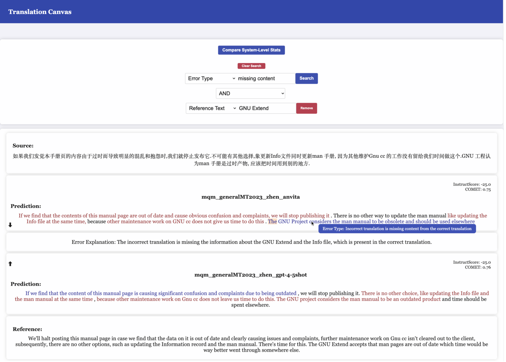
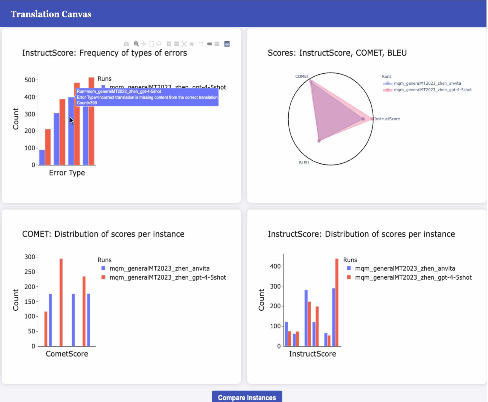
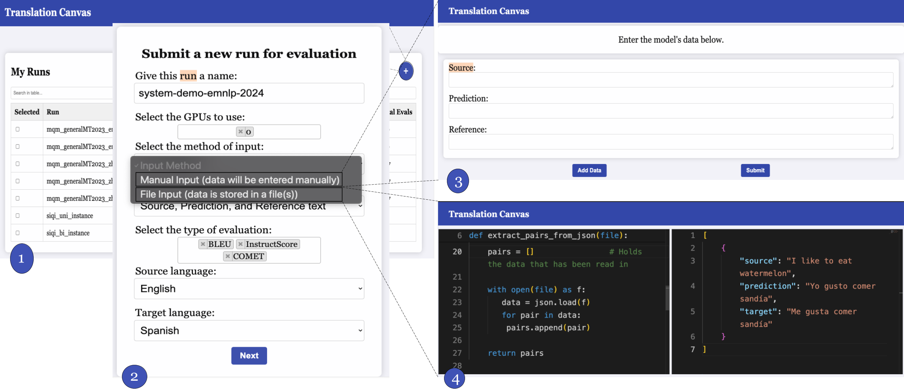

# Translation Canvas

[](https://badge.fury.io/py/translation-canvas)
[](https://opensource.org/licenses/MIT)

## Overview

**Translation Canvas** is a Python package designed for in-depth analysis and visualization of machine translation (MT) model outputs. It facilitates both system-level and instance-level evaluations, helping researchers identify, analyze, and comprehend the strengths and weaknesses of translation models.

The tool integrates multiple evaluation metrics, including BLEU, COMET, and InstructScore, to provide a comprehensive view of translation quality. Moreover, it offers detailed natural language explanations for identified errors, powered by InstructScore, and presents the results in an intuitive and interactive dashboard.

### Why Translation Canvas?

With the rapid development of machine translation systems, traditional evaluation tools like COMET and SacreBLEU often fall short in providing fine-grained insights. **Translation Canvas** bridges this gap by offering:

**Instance-level Error Analysis:** Highlight specific errors in translation instances and explain their nature using natural language descriptions.

**System-level Insights:** Aggregate error analysis to identify common pitfalls and strengths across entire datasets.

**Visual Comparisons:** Interactive dashboard for comparing the performance of different models on a granular level.

## Installation

You can easily install **Translation Canvas** via `pip`:

```bash
pip install translation-canvas
```

After installation, run a one-time setup script to configure necessary dependencies:

```bash
translation-canvas-setup
```

For the latest development version, you can install directly from the GitHub repository:

```bash
pip install git+https://github.com/ChinDandekar/translation_canvas
```

## Features 
<div style="text-align: center;">
  
</div>

### Error Analysis

**Translation Canvas** highlights errors at the instance level using color-coded spans. Hovering over these spans reveals natural language explanations, making it easier to understand the type of errors encountered.

### Comparison and Search

**Translation Canvas** allows users to compare multiple models simulatneously. It also provides a powerful search feature to users, allowing them to filter instancs by text, error type, error scale and error explanation


### System-level Dashboard

<div style="text-align: center;">
  
</div>

**Translation Canvas** provides a system-level dashboard to understand model performance at a system level.

### Instance Submission

<div style="text-align: center;">
  
</div>

Submit source-prediction-reference triplets through the user interface or by directly uploading files. The tool will process these instances, evaluate them using the integrated metrics, and provide detailed feedback.

## Usage

**Translation Canvas** operates as a web application, running in your browser. To start the application:

```bash
translation-canvas-start
```

By default, the app will be available at 
[http://127.0.0.1:5000](http://127.0.0.1:5000).

To run the app on a different port:

```bash
translation-canvas-start --port your-port
```


### Port Forwarding

If you are running **Translation Canvas** on a remote server via SSH, use port forwarding to access the app:

```bash
ssh -L your-port:127.0.0.1:5000 username@yourserver.com
```


## Evaluation and Feedback

**Translation Canvas** has been tested with machine translation experts, who found it to be both effective and user-friendly. The tool has shown to be particularly useful in pinpointing subtle errors that might be overlooked by traditional evaluation methods.


